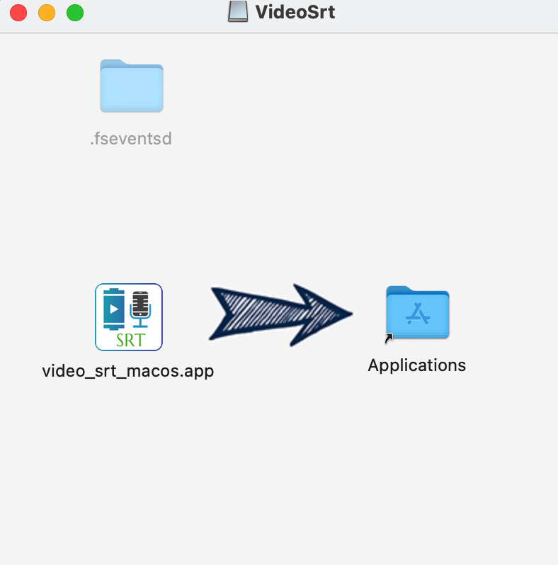
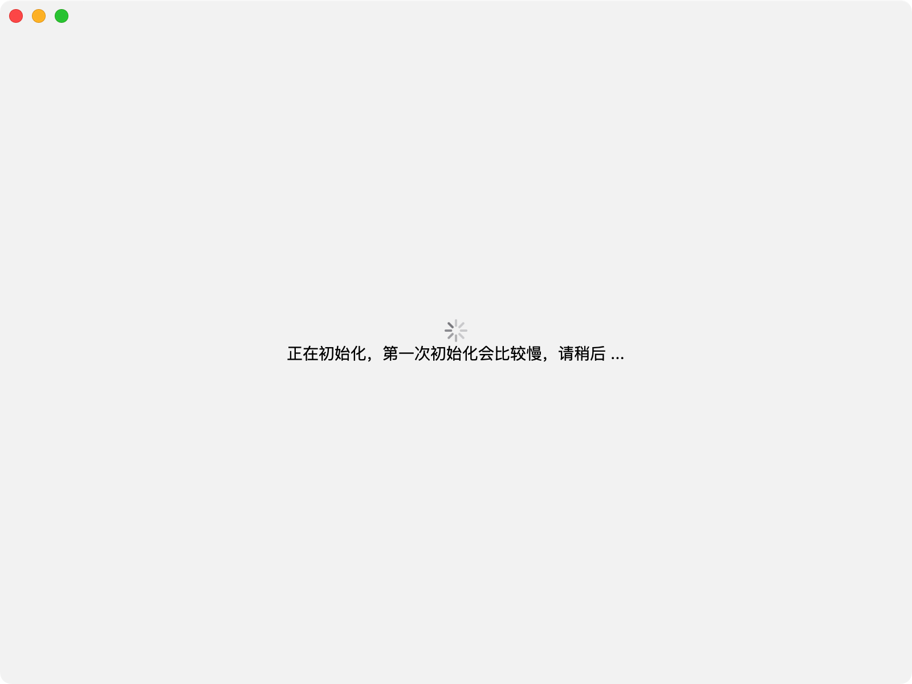
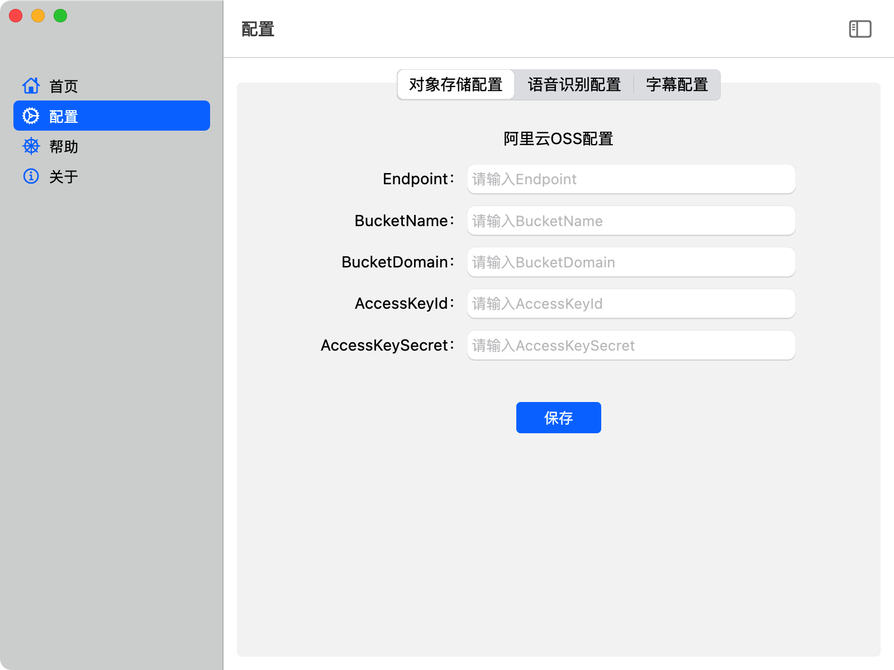
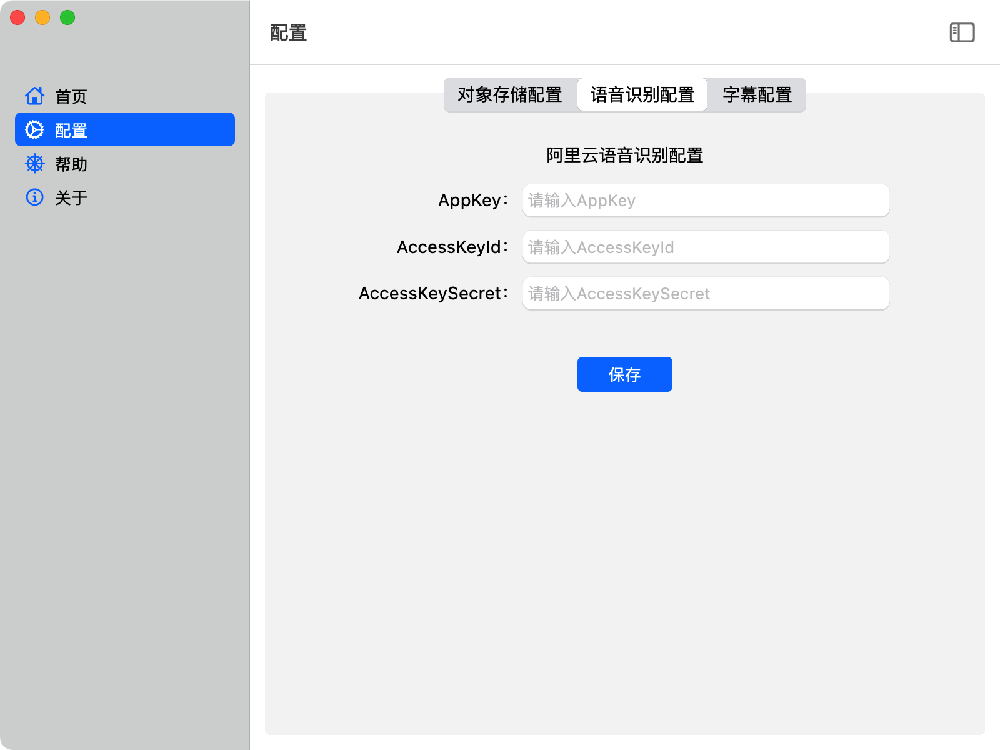
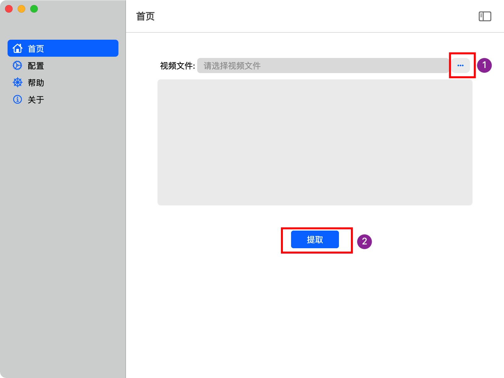
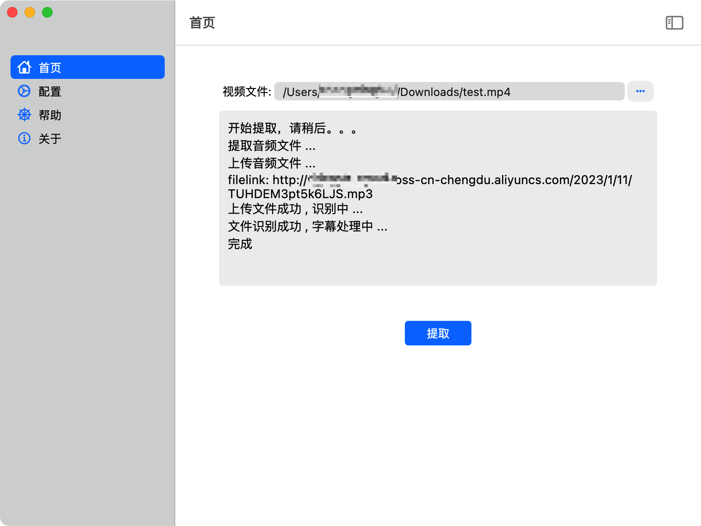

# video_srt_macos

本项目是使用 Flutter 封装 [video-srt](https://github.com/wxbool/video-srt) 成的 Mac 版本
- Windows 版本请见 [video-srt-windows](https://github.com/wxbool/video-srt-windows)

因条件有限，只在少数设备和系统上进行了测试，如在使用中遇到问题欢迎提 issue

## Getting Started

### 下载
下载 [release](https://github.com/loongwind/video-srt-mac/releases) 最新版本

### 安装

将应用程序拖到 Applications 文件夹
### 启动
第一次初始化时间相对较长，可能需要两三分钟请耐心等待

### 配置
1. 配置 OSS
   
2. 配置语音识别
   

## 使用
1. 先选择需要提取的视频文件
2. 点击提取即可

3. 提取过程中可看到提取的日志记录
   
4. 提取完成后会弹框提示，可以打开文件夹查看提取的字幕文件
   